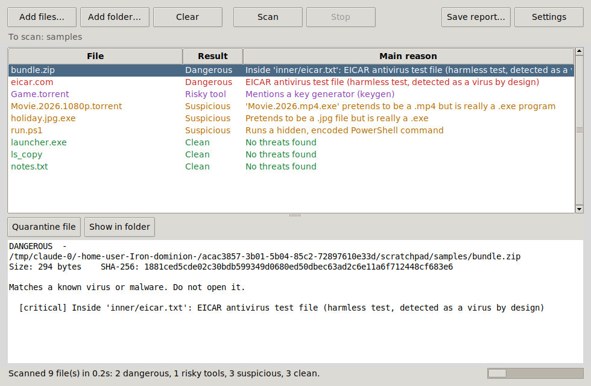

# File Scanner

A desktop app that checks files before you open them: programs, documents,
archives and `.torrent` files. It tells you whether each one is **Clean**,
**Suspicious**, a **Risky tool** (crack, keygen, cheat) or **Dangerous**
(known malware), and why.



> This is a second opinion, not a replacement for a full antivirus such as
> Windows Defender. Keep that switched on too.

## Download

Every push builds the app for Windows, macOS and Linux on GitHub.
Open the **Actions** tab, click the latest *Test and build* run, and download
`FileScanner-windows` (or `-macos` / `-linux`) from the **Artifacts** section.
Unzip it and double-click **FileScanner.exe**.

To publish a proper download page, create a tag such as `v0.1.0`; the build
then attaches the zips to a GitHub Release.

Windows may show "Windows protected your PC" because the app isn't signed
with a paid certificate. Click **More info → Run anyway**.

## What it checks

| Check | What it catches |
| --- | --- |
| Known-malware fingerprints | Files whose SHA-256 matches a list of known malware (update it from Settings, or `filescanner update`) |
| ClamAV (if installed) | ~8 million virus signatures from the free ClamAV engine |
| YARA rules | Password/cookie stealers, Discord token grabbers, crypto-wallet theft, reverse shells, hidden programs. Add your own rules to `filescanner/rules/` or set `FILESCANNER_RULES` to a folder |
| VirusTotal (optional) | Looks up the file's fingerprint across 70+ antivirus engines. The file itself is never uploaded |
| Disguises | `holiday.jpg.exe`, programs renamed to `.mp4`/`.pdf`, hidden right-to-left characters in names |
| Windows programs | Packers (UPX, Themida, VMProtect…), encrypted code, code injection, keyloggers, missing signature |
| Scripts | Hidden/encoded PowerShell, downloads, disabling Defender, deleting backups (ransomware) |
| Office documents | Macros that run on open, start programs or download files; remote templates; Equation Editor exploit |
| PDFs | JavaScript that runs on open, launching programs, attached `.exe` files |
| Archives | Scans every file inside zips (including zips in zips), spots zip bombs and password-protected archives hiding programs |
| Torrents | Lists what you'd download and warns about fake movies (`movie.mp4.exe`), "codec" installers, and cracks/keygens |
| Cracks & keygens | Flags them as **Risky tool**: not always viruses, but one of the most common ways malware spreads |

### Optional extras

- **ClamAV** – install from <https://www.clamav.net/downloads>, run `freshclam`
  once to download signatures, and the app uses it automatically.
- **VirusTotal** – get a free API key at <https://www.virustotal.com> and paste
  it into Settings (or set `VT_API_KEY`).

## Command line

```
filescanner-cli scan C:\Users\me\Downloads
filescanner-cli scan --json suspicious.exe > report.json
filescanner-cli engines      # show which scanners are active
filescanner-cli update       # download the latest malware fingerprints
```

Exit code: 0 clean, 1 suspicious, 2 risky tool, 3 dangerous.

## Running from source

```
pip install -r requirements.txt
python -m filescanner              # opens the window
python -m filescanner scan <path>  # command line
```

Build the executable yourself:

```
pip install -r requirements-dev.txt
python build.py                    # results in dist/
```

Run the tests with `python -m pytest`.

## How the verdict is decided

- **Dangerous** – matches a known virus (fingerprint list, ClamAV, VirusTotal)
  or does something only malware does (e.g. a ransom note + deleting backups).
- **Risky tool** – crack, keygen, activator, cheat or hacking tool.
- **Suspicious** – one strong warning sign, or two or more medium ones.
- **Clean** – nothing worrying found.

The test file used in `tests/` is the harmless
[EICAR test file](https://www.eicar.org/download-anti-malware-testfile/),
which every antivirus detects on purpose. It is built at run time so your own
antivirus won't flag this repository.
